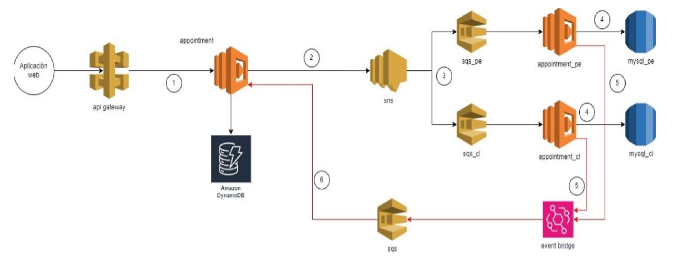

# 🏥 Backend de Agendamiento de Citas Médicas

Este servicio backend permite registrar, consultar y actualizar citas médicas para asegurados en Perú y Chile, integrando servicios de AWS como Lambda, DynamoDB, SNS, SQS y EventBridge.

## 🚀 Funcionalidades

- Registrar una cita médica (`POST /appointments`)
- Consultar citas por asegurado (`GET /appointments/{insuredId}`)
- Listar horarios disponibles (`GET /schedules`)
- Crear horarios diponibles (`POST /schedules`)

## 🛠️ Tecnologías y herramientas

- AWS Lambda
- DynamoDB
- SNS + SQS + EventBridge
- MySQL (RDS)
- Serverless Framework
- Node.js + TypeScript
- Arquitectura hexagonal
- Principios SOLID
- Swagger/OpenAPI

## 🔧 Instalación depenencias

```bash
npm install
```

📦 Despliegue

```bash
npm run deploy:dev
```

# Estructura del proyecto

```bash

src
├── application
│   ├── dtos
│   │   ├── create-appointment.input.ts
│   │   └── create-schedule.input.ts
│   └── use-cases
│       ├── create-appointment.use-case.ts
│       ├── create-schedule.use-case.ts
│       ├── get-appointment.use-case.ts
│       ├── list-available-schedule.use-case.ts
│       └── update-appointment-status.use-case.ts
├── domain
│   ├── constants
│   │   └── dynamo-prefix.enum.ts
│   ├── entities
│   │   ├── appointment.entity.ts
│   │   └── schedule.entity.ts
│   ├── ports
│   │   └── notification-service.port.ts
│   └── repositories
│       ├── appointment-repository.port.ts
│       └── schedure-repository.port.ts
├── infrastructure
│   ├── config
│   │   └── app.config.ts
│   ├── dynamodb
│   │   └── dynamo.service.ts
│   ├── eventbridge
│   │   └── eventbridge.service.ts
│   ├── lambda
│   │   ├── appointment-cl-handler.ts
│   │   └── appointment-pe-handler.ts
│   ├── mysql
│   │   ├── mysql-appointment-cl.repository.ts
│   │   ├── mysql-appointment-pe.repository.ts
│   │   ├── mysql-cl.connection.ts
│   │   └── mysql-pe.connection.ts
│   ├── repositories
│   │   ├── appointment-dynamo.repository.ts
│   │   └── schedule-dynamo.repository.ts
│   ├── sns
│   │   └── sns-notification.service.ts
│   └── sqs
├── interfaces
│   ├── controllers
│   │   ├── appointment
│   │   │   ├── create-appointment.controller.ts
│   │   │   ├── get-appointments.controller.ts
│   │   │   └── update-appointment.controller.ts
│   │   └── schedule
│   │       ├── create-schedule.controller.ts
│   │       └── get-schedule.controller.ts
│   ├── dtos
│   │   ├── appointment.schema.ts
│   │   └── schedule.schema.ts
│   └── handlers
│       ├── appointment-handler.ts
│       └── schedule-handler.ts
└── shared
    ├── response.ts
    └── zod
        └── format-zod-errors.ts
```

# Pruebas

```bash
npm run test

```

# Variables de entorno

```bash
DYNAMO_TABLE_NAME=
SNS_TOPIC_PE=
SNS_TOPIC_CL=
RDS_PE_HOST=
RDS_PE_PORT=
RDS_PE_USER=
RDS_PE_PASSWORD=
RDS_PE_DB=
RDS_CL_HOST=
RDS_CL_PORT=
RDS_CL_USER=
RDS_CL_PASSWORD=
RDS_CL_DB=
EVENT_BRIDGE_BUS=
EVENT_BRIDGE_DETAIL_TYPE=

```

# Documentacion

```bash
https://seguros-indra-swagger-docs.s3.us-east-1.amazonaws.com/index.html
```

## Flujo Lógico de los Endpoints

### 1. POST `/appointments`

- El cliente envía la solicitud con los datos para crear una cita.
- El handler recibe la petición y valida los datos.
- Si la validación falla, responde con un error 400 (Bad Request).
- Si la validación es exitosa, crea la cita en DynamoDB.
- Publica un evento en SNS o EventBridge notificando la creación.
- Devuelve la información de la cita.
- En caso de error inesperado, responde con un error 500 (Internal Server Error).

## Ejemplos de Uso

### POST /appointments

```http
POST /appointments
Content-Type: application/json

{
   "insuredId":"00878",
   "scheduleId":6010,
   "countryISO":"PE",
   "email":"jamz@gmail.com",//opcional
   "description":"rutinaria"//opcional
}
```

### Respuesta esperada:

```http
{
    "success": true,
    "message": "Cita creada correctamente",
    "data": {
        "insuredId": "00878",
        "appointmentId": "bf5700c6-ac8d-497f-812f-6b72ec18f1e2",
        "scheduleId": 6010,
        "description": "rutinaria",
        "status": "PENDING",
        "_createdAt": "2025-07-20T02:05:32.394Z",
        "_updatedAt": "2025-07-20T02:05:32.394Z",
        "countryISO": "PE",
        "email": "jamz@gmail.com"
    }
}

```


---

### 2. GET `/appointments/{insuredId}`

- El cliente solicita las citas asociadas a un asegurado específico.
- El handler obtiene el `insuredId` de la ruta.
- Consulta DynamoDB para obtener las citas del asegurado.
- Si existen, responde con un 200 (OK) y la lista de citas.
- En caso de error inesperado, responde con un error 500.

## Ejemplos de Uso

### GET /appointments/{insuredId}
```http
GET /appointments/00878
Content-Type: application/json

```

### Respuesta esperada:

```http
{
    "success": true,
    "message": "Citas obtenidas correctamente",
    "data": [

        {
            "insuredId": "00878",
            "appointmentId": "0e8c1c34-9c64-4c59-8e7c-fc9ea5ed0609",
            "scheduleId": 101,
            "description": null,
            "status": "PENDING",
            "_createdAt": "2025-07-19T12:22:26.003Z",
            "_updatedAt": "2025-07-19T12:22:26.003Z",
            "email": null
        },
      
        {
            "insuredId": "00878",
            "appointmentId": "5f5b3700-1594-43d7-8341-59d18b71e2da",
            "scheduleId": 604,
            "description": null,
            "status": "COMPLETED",
            "_createdAt": "2025-07-19T19:12:06.718Z",
            "_updatedAt": "2025-07-19T19:12:06.718Z",
            "email": null
        },
       
        {
            "insuredId": "00878",
            "appointmentId": "fc1f711f-fe7d-428b-8226-1bc95db0709e",
            "scheduleId": 603,
            "description": null,
            "status": "COMPLETED",
            "_createdAt": "2025-07-19T18:52:38.295Z",
            "_updatedAt": "2025-07-19T18:52:38.295Z",
            "email": null
        }
    ]
}

```
---

### 3. POST `/schedule`

- El cliente envía datos para crear un horario disponible.
- El handler valida los datos recibidos.
- Si la validación falla, responde con un 400.
- Si es válido, guarda el horario en la base de datos (RDS o Dynamo).
- Responde con los datos del horario creado.
- En caso de error inesperado, responde con un error 500.

## Ejemplos de Uso
### POST /schedule

```http
POST /schedule
Content-Type: application/json

{
    "scheduleId": 101,
    "centerId": 4,
    "specialtyId": 3,
    "medicId": 4,
    "date": "2024-09-30T12:30:00Z"
}
```

### Respuesta esperada:

```http
{
    "success": true,
    "message": "Horario asignado con éxito",
    "data": {
        "scheduleId": 101,
        "centerId": 4,
        "specialtyId": 3,
        "medicId": 4,
        "date": "2024-09-30T12:30:00.000Z"
    }
}

```
---

### 4. GET `/schedule`

- El cliente solicita los horarios disponibles.
- El handler realiza la consulta a la base de datos para obtener horarios.
- Responde con un 200 y la lista de horarios.
- En caso de no encontrar horarios, puede devolver una lista vacía con 200.
- En caso de error inesperado, responde con un error 500.


## Ejemplos de Uso

### GET /schedule
```http
GET /schedule
Content-Type: application/json

```

### Respuesta esperada:

```http
{
    "success": true,
    "message": "Horarios disponibles",
    "data": [
        {
            "scheduleId": 1,
            "centerId": 101,
            "specialtyId": 202,
            "medicId": 303,
            "date": "2025-07-20T10:00:00.000Z"
        },
        {
            "scheduleId": 101,
            "centerId": 4,
            "specialtyId": 3,
            "medicId": 4,
            "date": "2024-09-30T12:30:00.000Z"
        }
    ]
}

```

### ARQUITECTRURA


```
